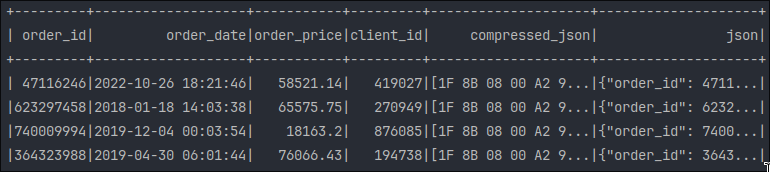

# Processamento de JSON Altamente Comprimidos em Larga Escala na AWS 🚀

Imagine lidar com um banco de dados OLTP em produção sem indexação, com baixa performance e bilhões de registros nas tabelas principais do negócio. Parece o pesadelo de qualquer engenheiro de dados, certo? Recentemente, enfrentamos exatamente esse desafio em um dos projetos em que atuamos como Engenheiros de Dados.

## 🎯 O desafio:  
Extrair informações de um banco origem e disponibilizá-las para os usuários dentro da AWS, enfrentando a lentidão do banco e o tamanho massivo das tabelas.

## 💡 O insight:  
Durante nossa investigação, descobrimos uma coluna que armazenava as mesmas informações de tabelas com bilhões de registros não indexados, mas em formato JSON comprimido em GZIP. Apesar de otimizada para armazenamento, essa coluna continha registros com mais de **800 mil caracteres cada**!

## 🔧 A solução estratégica:  
Optamos por ingerir apenas essa coluna comprimida para o S3, processá-la e descomprimí-la usando **AWS Glue** com **PySpark**. Os dados foram transformados em múltiplas tabelas organizadas no formato **Iceberg**, otimizando o consumo via **Athena**. Além disso, criamos visões sumarizadas no **Data Warehouse**, tornando os dados mais acessíveis e prontos para análise.

## 🚀 Explorando diferentes abordagens:  
Testamos descompressão e transformação com:
- **Pandas + UDFs do PySpark**: eficiente, mas com sobrecarga de transformação entre Python e JVM.  
- **Scala**: eliminou a transformação Python → JVM, entregando melhor desempenho.

## 💾 Simulação e reprodutibilidade:  
Criamos um repositório no GitHub para simular o comportamento do banco, gerando arquivos Parquet que replicam a estrutura original. A partir disso, processamos os dados e os disponibilizamos em tabelas **Iceberg** com o catálogo no Hadoop, compartilhando práticas de organização e performance.

Essa experiência reforçou algo que sempre acredito: mesmo em cenários adversos, com análise detalhada e escolhas estratégicas, é possível encontrar soluções robustas para problemas complexos de dados.

Se você já enfrentou desafios similares, compartilhe nos comentários! Vamos trocar ideias e experiências! 🚀💬  

## 📖 O passo a passo

### 1. UDF
Aqui mostramos o código da UDF em Scala e a compilação manual do arquivo JAR. Essa seção é opcional e pode-se utilizar o arquivo
pré-compilado disponível no repositório.

#### 1.1 Código Scala

O PySpark precisa de um arquivo JAR contendo nossa UDF em Scala para poder executá-la. Então, começando com um projeto Scala
básico, crie um arquivo chamado *Decompress.scala* contendo o seguinte código:

  ```scala
  import org.apache.spark.sql.api.java.UDF1
  import java.io.ByteArrayInputStream
  import java.util.zip.GZIPInputStream

  class Decompress extends UDF1[Array[Byte], Array[Byte]] {
    override def call(t1: Array[Byte]): Array[Byte] = {
      val inputStream = new GZIPInputStream(new ByteArrayInputStream(t1))
      org.apache.commons.io.IOUtils.toByteArray(inputStream)
    }
  }
  ```

Note que nossa classe Decompress está estendendo a UDF1 do Spark que aceita um argumento, neste caso
um array de bytes (dados comprimidos) e também esperamos que a saída seja um array de bytes (dados não comprimidos).

Agora que temos nosso código completo, podemos compilá-lo com o sbt:
  
`sbt clean package`
   
O arquivo JAR necessário encontra-se dentro da pasta target do seu projeto.

#### 1.2 Código Python

Para permitir que o PySpark reconheça nossa UDF, precisamos adicionar o arquivo JAR quando criamos nossa Spark session:

```python
spark = (SparkSession.builder
.config(“spark.jars”, “./scala_udf.jar”)
.getOrCreate())
```

Agora vamos registá-lo no contexto SQL para podermos chamá-lo com o Spark SQL:

```python
sqlContext = SQLContext(spark.sparkContext)
spark.udf.registerJavaFunction(“decompress_scala”, “Descompactar”, T.BinaryType())
```
Aqui decompress_scala será o nome registrado no contexto SQL, Decompress é o nome da classe da nossa UDF e BinaryType
refere-se ao seu tipo de retorno.

Para usá-lo, basta adicionar a seguinte linha de código:
```python
df = spark.sql(“select *, decode(decompress_scala(compressed_json), ‘utf8’) as json from df”)
```
Aqui, usamos decode para converter nossa saída binária em uma string utf-8, pois isso era necessário no exemplo escolhido.

#### 1.3 Resultados da execução
Lendo o arquivo data.parquet fornecido, descompactamos e decodificamos uma coluna JSON gzipada:



### 2. Código principal
#### 2.1 Recursos

- Geração de conjuntos de dados fictícios para clientes, pedidos e pagamentos usando `Faker`.
- Armazenamento de dados no formato JSON compactado dentro de arquivos Parquet.
- Descompactação e transformação de dados JSON em tabelas estruturadas com PySpark.
- Carregamento dos dados processados em tabelas Iceberg com esquemas predefinidos.
- Suporte à imposição de esquemas e fluxos de ETL escaláveis.

#### 2.2 Instalação

1. Clone o repositório:
   ```bash
   git clone https://github.com/leonardovsramos/decompress-json-etl.git
   ```

2. Navegue até o diretório do projeto:
   ```bash
   cd decompress-json-etl
   ```

3. Instale as dependências usando `uv`:
   ```bash
   uv setup
   ```

---

#### 2.3 Uso

##### 2.3.1 Geração de dados fictícios
Execute o script para gerar dados JSON compactados:
```bash
python generate_json.py --num_orders <numero_de_pedidos> --output_path <caminho_do_arquivo_de_saida>
```

**Exemplo:**
```bash
python generate_json.py --num_orders 100 --output_path ./data
```

##### 2.3.2 Processar dados em tabelas Iceberg
Use o script ETL para descompactar e carregar os dados nas tabelas Iceberg:
```bash
python process_json.py --input_path <caminho_do_arquivo_de_entrada>
```

**Exemplo:**
```bash
python process_json.py --input_path ./data/compressed_json.parquet
```

---

#### 2.4 Como funciona

##### 2.4.1 Geração de dados
- Dados fictícios para clientes, pedidos e pagamentos são criados usando a biblioteca `Faker`.
- Os dados são compactados no formato JSON e armazenados em arquivos Parquet.

##### 2.4.2 Transformação de dados
- O JSON compactado é descompactado usando uma UDF em Scala.
- O PySpark transforma os dados JSON em registros estruturados para:
    - Pedidos
    - Clientes
    - Itens do Pedido
    - Pagamentos

##### 2.4.3 Carregamento de dados
- Os dados transformados são carregados em tabelas Iceberg, aplicando esquemas e propriedades pré-definidos.

#### 2.5 Definições de esquema

##### 2.5.1 Tabela de pedidos (Orders)
| Coluna        | Tipo               | Descrição                    |
|---------------|:------------------:|-----------------------------|
| order_id      | INT                | Identificador único do pedido. |
| order_date    | TIMESTAMP          | Data e hora do pedido.      |
| order_price   | DECIMAL(15,2)      | Preço total do pedido.      |

##### 2.5.2 Tabela de clientes (Clients)
| Coluna        | Tipo               | Descrição                   |
|---------------|:------------------:|-----------------------------|
| order_id      | INT               | Identificador vinculado ao pedido. |
| client_id     | INT               | Identificador único do cliente. |
| first_name    | STRING            | Primeiro nome do cliente.  |
| last_name     | STRING            | Sobrenome do cliente.      |
| cpf           | STRING            | CPF brasileiro do cliente. |
| rg            | STRING            | RG brasileiro do cliente.  |
| email         | STRING            | Endereço de e-mail do cliente. |
| birth_date    | DATE              | Data de nascimento do cliente. |

##### 2.5.3 Tabela de itens do pedido (Order Items)
| Coluna           | Tipo               | Descrição                   |
|------------------|:------------------:|-----------------------------|
| order_id         | INT                | Identificador vinculado ao pedido. |
| id               | INT                | Identificador único do item. |
| item_name        | STRING             | Nome do item.              |
| item_price       | DECIMAL(15,2)      | Preço do item.             |
| item_description | STRING             | Descrição do item.         |

##### 2.5.4 Tabela de pagamentos (Payments)
| Coluna                    | Tipo               | Descrição                   |
|---------------------------|:------------------:|-----------------------------|
| order_id                  | INT                | Identificador vinculado ao pedido. |
| id                        | INT                | Identificador único do pagamento. |
| method                    | STRING             | Método de pagamento (dinheiro, cartão de crédito, etc.). |
| amount                    | DECIMAL(15,2)      | Valor total pago.           |
| tranch_value              | DECIMAL(15,2)      | Valor de cada parcela (se aplicável). |
| tranch_payment_date       | DATE               | Data do pagamento da parcela. |
| tranch_installment_number | SMALLINT           | Número da parcela.          |

## Repositório no GitHub
https://github.com/leonardovsramos/decompress-json-etl

## Referências
https://spark.apache.org/docs/3.5.1/api/java/org/apache/spark/sql/api/java/UDF1.html
https://spark.apache.org/docs/3.5.2/sql-ref-functions-udf-scalar.html

## Autores
[Leonardo Vieira dos Santos Ramos](https://www.linkedin.com/in/leonardolvsr/)

[Vítor Rodrigues Gôngora](https://www.linkedin.com/in/vitorgongora/)

----

# Processing Highly Compressed JSON at Scale on AWS 🚀

Imagine dealing with a production OLTP database with no indexing, poor performance, and billions of records in the main business tables. Sounds like a nightmare for any data engineer, right? Recently, I faced exactly this challenge in one of the projects where I worked as a Data Engineer.

## 🎯 The Challenge:  
Extract information from this source database and make it available to users within AWS, despite the sluggish performance and massive size of the tables.

## 💡 The Insight:  
During our investigation, we discovered a column that stored the same information as the tables with billions of records but in JSON format compressed with **GZIP**. While optimized for storage, this column contained records with more than **800,000 characters each**!

## 🔧 The Strategic Solution:  
We decided to ingest only this compressed column into **S3**, process it, and decompress it using **AWS Glue** with **PySpark**. The data was transformed into multiple tables organized in the **Iceberg** format, optimizing consumption through **Athena**. Additionally, we created summarized views in the **Data Warehouse**, making the data more accessible and analysis-ready.

## 🚀 Exploring Different Approaches:  
We tested decompression and transformation using:
- **Pandas + PySpark UDFs**: efficient but with the overhead of transforming between Python and the JVM.  
- **Scala**: eliminated the Python → JVM transformation, resulting in better performance.

## 💾 Simulation and Reproducibility:  
We created a GitHub repository to simulate the database behavior by generating Parquet files that replicate the original structure. From there, we processed the data and made it available in **Iceberg** tables using a Hadoop catalog, sharing best practices for organization and performance.

This experience reinforced something I always believe: even in adverse scenarios, with detailed analysis and strategic decisions, it is possible to find robust solutions for complex data processing challenges.

If you’ve faced similar challenges, share your experiences in the comments! Let’s exchange ideas and insights! 🚀💬
